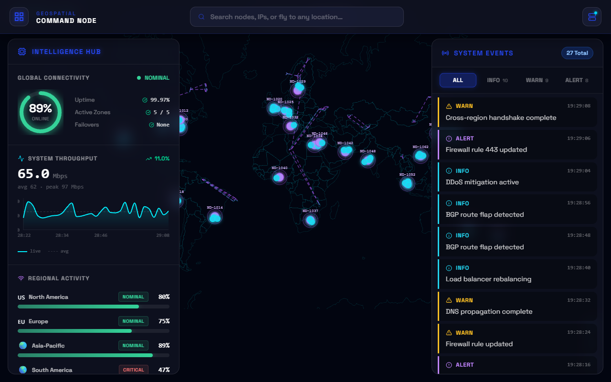
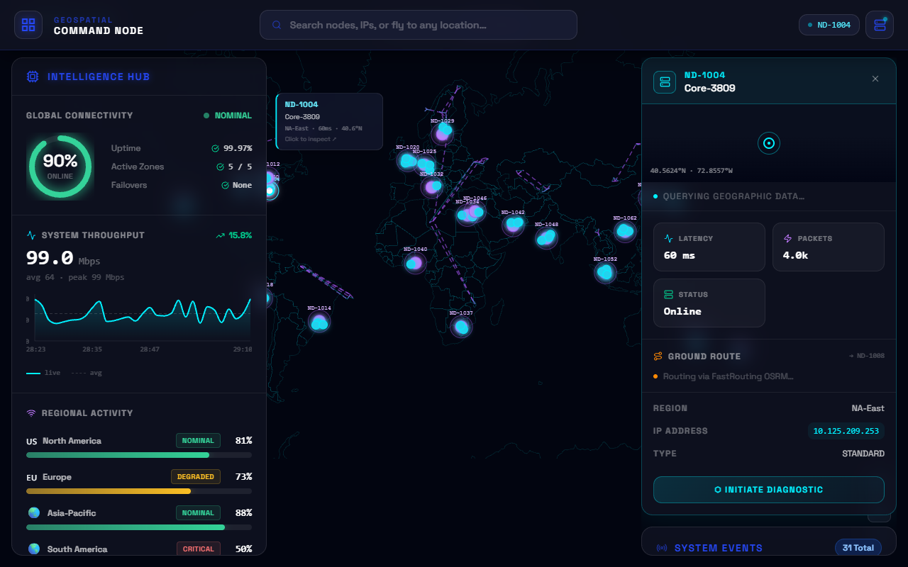

<div align="center">
  
  <h1>Nexus Command Center</h1>
  <p><strong>A high-performance, real-time command center dashboard built with React 19 and Vite 8.</strong></p>

  [](https://react.dev/)
  [](https://vitejs.dev/)
  [](#)
  [](https://tailwindcss.com/)
</div>

<br />

Nexus Command Center is a futuristic, immersive geospatial dashboard designed for monitoring global server networks, analyzing node health, and visualizing high-volume data streams. Inspired by sci-fi interfaces and built with bleeding-edge web technologies, it features both an interactive 3D WebGL globe and a highly detailed 2D topological map.

---

## 📸 Interface Previews

### Global Overview
Monitor worldwide network traffic, global connectivity, and regional activity in real-time.


### Node Diagnostics & Routing
Click on any node (either on the 3D globe or 2D map) to view deep diagnostics, latency metrics, and real-world ground/fiber routing to its nearest neighbor.


---

## ✨ Core Features

* **🔌 Real-Time WebSocket Telemetry**
  * A dedicated Node.js WebSocket backend streams live fluctuating latencies, throughput metrics, and dynamic server logs at 2000ms intervals directly into the React context.
* **🌍 Interactive Maps (2D & 3D)**
  * **3D WebGL Globe**: Powered by `react-globe.gl`. Features auto-rotation, glowing connection arcs, and a **"Click-to-Fly"** search engine that smoothly orbits to any physical address on Earth.
  * **2D Flat Map**: Powered by `react-simple-maps` with smooth panning and zooming, overlaying a real-world terrain map.
* **🎛️ Advanced Node Diagnostics**
  * **MapToolkit Integration**: Uses real geocoding to resolve a node's exact location, elevation, and address based on its coordinates.
  * **FastRouting (OSRM)**: Dynamically calculates the actual ground driving route vs. theoretical subsea fiber latency between datacenters.
* **📜 Live System Logs**
  * Streaming terminal of `INFO`, `WARN`, and `ALERT` security and network events, complete with filtering.
* **🎨 "Glassmorphism" UI & Hack Mode**
  * Translucent components with neon accents (Cyan/Purple), built entirely with raw Tailwind CSS 4 utilities.
  * **Easter Egg**: Type `hack` anywhere on your keyboard to instantly trigger a system override, flipping the UI into a glowing Terminal Green matrix theme.
* **⚡ Highly Optimized**
  * **Lazy Loading**: The heavy 3D Globe component is lazily loaded via `React.Suspense` to ensure the initial app payload is tiny.
  * **Rolldown Chunking**: Automated vendor chunking separates React, Three.js, Maps, and UI libraries into cacheable assets.

---

## 🛠️ Tech Stack

| Category | Technology | Description |
| :--- | :--- | :--- |
| **Framework** | [React 19](https://react.dev/) | Latest concurrent features and hooks |
| **Bundler** | [Vite 8](https://vite.dev/) | Ultra-fast HMR and optimized build via Rolldown |
| **Backend** | [ws](https://www.npmjs.com/package/ws) | Native Node.js WebSockets for live data streaming |
| **Styling** | [Tailwind CSS 4](https://tailwindcss.com/) | Utility-first CSS with CSS variable theme |
| **3D Engine** | [react-globe.gl](https://github.com/vasturiano/react-globe.gl) | WebGL-accelerated interactive globe |
| **2D Engine** | [react-simple-maps](https://www.react-simple-maps.io/) | D3-based SVG maps with panning |
| **Charts** | [Recharts](https://recharts.org/) | Composable SVG charting |
| **Geo API** | [MapToolkit](https://maptoolkit.net/) | Reverse geocoding and routing |

---

## 🚀 Getting Started

### 1. Prerequisites
Ensure you have Node.js (v18+ recommended) and `npm` installed. You will also need a free API key from [MapToolkit](https://maptoolkit.net/).

### 2. Installation
Clone the repository and install dependencies:
```bash
git clone https://github.com/amafjarkasi/nexus-command-center.git
cd nexus-command-center
npm install
```

### 3. Environment Variables
To prevent CORS errors and securely use the MapToolkit API, you must configure your environment variables.
Copy the example file:
```bash
cp .env.example .env
```
Open `.env` and replace `your_api_key_here` with your actual MapToolkit API key.

### 4. Start the Application
You need to run both the WebSocket backend and the Vite frontend server. Open two separate terminals:

**Terminal 1 (Backend):**
```bash
npm run backend
```

**Terminal 2 (Frontend):**
```bash
npm run dev
```

Navigate to `http://localhost:5173` in your browser.

---

## 🏗️ Architecture & Scripts

### Code Organization
* `server.js` - Native Node WebSocket backend streaming simulated network node arrays and system logs.
* `src/hooks/useMockData.js` - Connects to the WebSocket backend, ingests ticks, and populates the global React context.
* `src/components/GlobeView.jsx` - Isolated 3D engine, lazily loaded.
* `src/services/maptoolkit.js` - Dedicated API abstraction for fetching geographic data through the Vite proxy.

### Available Commands
* `npm run backend` — Starts the WebSocket telemetry server on port 8080.
* `npm run dev` — Starts the Vite frontend server.
* `npm run build` — Builds the application for production, intelligently chunking vendor libraries.
* `npm run preview` — Boots a local server to preview the production build.
* `npm run lint` — Runs ESLint across the codebase.

---

<p align="center">
  <i>Designed and engineered for the future of network monitoring.</i>
</p>
